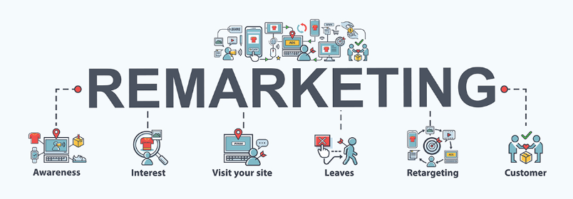

CUSTOMER REMARKETING 

        

# **Table Of Contents**

### **Background**
- A top tier Portuguese bank aims to promote a marketing campaign with existing customers to increase their term deposits. A similar campaign that was run last quarter showed an average single-digit conversion rate. In the last town hall, the marketing head wants the analytics team to come up with an effective remarketing model to increase the conversion ratio to double-digit with same budget as per the last campaign

### **Challenge**
-	Build a classification model to identify customers that have a high probability of converting into depositors based on their historical transaction history
-	Ensure train and deployment pipelines are created separately to mirror real world scenarios
-	Automate entire workflow with relevant technologies 

### **Requirements**
- -	`Input data folder` on GCS has the latest historical data for training
-	`Weekly data folder` is created to receive weekly files that need to be scored 
-	`Output data folder` is created to receive output files with probability scores for each customer
-	Trigger training pipeline when new input or historical file is added to a GCS folder. Output of the training pipeline is a final model object placed in a GCS folder called `model output`
-	Trigger deploy pipeline when new weekly file is submitted to the frontend UI built with Streamlit 
      - Use the FastAPI frontend web endpoint in conjunction with google cloud storage to upload the file to a GCS bucket 
      - Deploy the model using k-serve [Load, create deployment specifications, dockerization, push to GCR, deploy on Kubernetes, generate predictions, & save on GCS bucket]
      - Return status on frontend UI with URL to pick up scored file: return {"status": "success", "predictions URL": predictions_URL}
-	Visualization of pipeline or logging of metrics can be done in Kubeflow or 3rd party applications like Datadog, & New Relic

### **Additional scope**
- Track metrics of deployed model using Grafana and Prometheus
- Integrate MLFlow into the Kubeflow pipelines for model registry and metadata store
- Include explainability concepts using SHAP
- Deploy GCP infrastructure using Terraform for futher automation of pipeline 

### **High level architecture**

### **Implementation plan for the above architecture** 
-	Experiment in notebook to train-test-evaluate historical data in GCS 
-	Create separate classes, and functions script files for modularity 
-	Create a kubeflow training pipeline including relevant classes, and functions
-	The training pipeline is triggered with a cloud function which is invoked by a GCS storage trigger when there is a new “input” data file added to a GCS bucket
-	The output of this is a final model object which is stored on a GCS bucket 
-	The deployment pipeline is triggered by another cloud function which is invoked by another GCS storage trigger on receiving a new “weekly” file that needs to be scored
-	The serialized Model is deployed on Kubernetes  
-	Output of the scored features is stored in on a GCS bucket 
-	The client gets a message on success of predictions within the UI and a link to access the file 
-	Visualization of entire end to end pipeline is in Kubeflow 
 
### **Technologies**
-	Python, sklearn, TensorFlow, Keras
-	Google Cloud Storage, & Cloud storage trigger
-	Cloud functions
-	Docker
-	Kubeflow
-	K-serve
-	FastAPI-Uvicorn
-	Streamlit 

